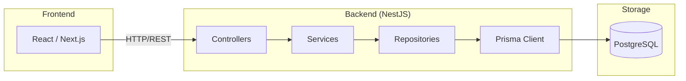

# doc:architecture — アーキテクチャ設計書生成

## 目的

Basic Design ステージの ADR からシステム全体のアーキテクチャ構成を可視化した
設計ドキュメントを生成します。技術スタック選定の根拠・コンポーネント間の依存関係・
外部システムとの接続を一覧できる形で出力します。

**このスキルは `/docs/deliverables/` にのみ書き込みます。`/docs/adr/` は変更しません。**

---

## 実行手順

### ステップ1：ADR を読み込む

1. `/docs/adr/0000-index.md` を読み込む
2. `## Basic Design` セクションの Accepted ADR をすべて読み込む
3. 各 ADR から以下を抽出する：
   - `Decision` → 採用技術名・構成方針
   - `Context` → 選定の背景・比較対象
   - `Consequences > Benefits` → 採用根拠
   - `Consequences > Drawbacks` → 既知の制約
   - `Consequences > Side Effects` → CI/CD・チーム運用への影響

### ステップ2：ドキュメントを生成する

`/docs/deliverables/basic-design/architecture.md` を以下の構造で生成します。

```markdown
# アーキテクチャ設計書

> 本書は ADR から自動生成されています。
> 原典: /docs/adr/ | 生成日: {今日の日付}

---

## 1. システム概要

{Basic Design ADR の Context を統合してシステムの目的・スコープを記述}

---

## 2. 技術スタック一覧

| レイヤー | 採用技術 | バージョン | 根拠 ADR | 選定理由（要約） |
|---------|---------|-----------|---------|----------------|
| {フロントエンド/バックエンド/DB/ORM/etc} | {技術名} | {あれば} | ADR-NNNN | {Benefits の要約} |
...

---

## 3. アーキテクチャ図

\```mermaid
flowchart LR
  {Decision から読み取れるコンポーネントをレイヤー構造で表現}
  {subgraph でレイヤーをグループ化する}
  {矢印で依存方向を示す（データの流れではなく依存の方向）}
\```

---

## 4. コンポーネント別設計決定

{各 Basic Design ADR について記載}

### ADR-NNNN: {タイトル}

**決定:** {Decision}

**背景:** {Context}

**採用根拠:**
{Consequences > Benefits}

**既知の制約:**
{Consequences > Drawbacks}

**運用上の注意:**
{Consequences > Side Effects（あれば）}

---

## 5. 外部依存関係

{Decision から外部サービス・DB・マネージドサービスを抽出して列挙}

| 依存先 | 種別 | 用途 | 根拠 ADR |
|--------|------|------|---------|
...

---

## 6. 変更履歴

| ADR | 変更内容 | 置換先 | 日付 |
|-----|---------|--------|------|
{Superseded ADR を列挙}
```

### ステップ3：完了を通知する

```
📄 アーキテクチャ設計書を生成しました
  出力先: /docs/deliverables/basic-design/architecture.md
  対象 ADR: ADR-NNNN, ...
```

---

## Mermaid flowchart 生成ガイド

**基本テンプレート（NestJS + Prisma の例）：**



コンポーネント推論ルール：

| Decision キーワード | コンポーネント |
|--------------------|--------------|
| 「Prisma を ORM として採用」 | Prisma Client ノードを追加、DB への矢印 |
| 「NestJS でバックエンドを構築」 | Backend subgraph に Controllers/Services/Repositories |
| 「GraphQL を採用」 | HTTP/REST → GraphQL に変更 |
| 「Redis をキャッシュに使用」 | Cache ノードを追加 |
| 「マイクロサービス」 | 複数の Backend subgraph |

---

## 注意事項

- コンポーネント名は Decision のキーワードから推論し、一般的な慣例名（Controller/Service/Repository等）を使う
- Basic Design ADR が 0 件の場合は「Basic Design ステージの ADR がまだ記録されていません」と出力する
