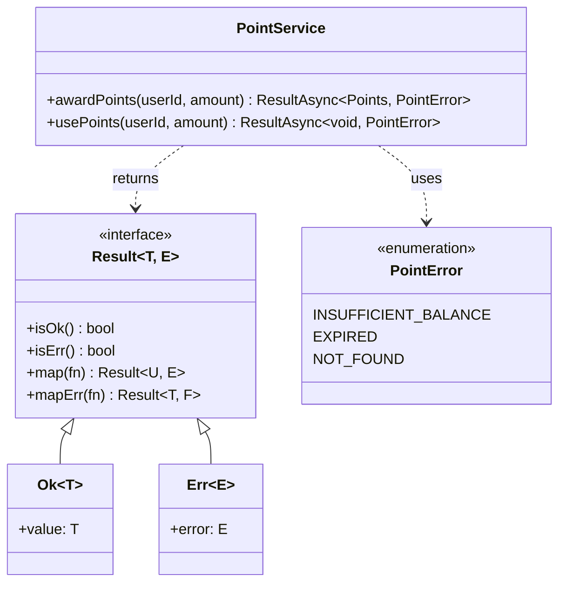

# doc:class — クラス図・実装パターン設計書生成

## 目的

Detailed Design ステージの ADR から、実装レベルの型・クラス・インターフェース・
パターンを可視化したドキュメントを生成します。コードレビューの基準書・
オンボーディング資料として使えるレベルの詳細度を目指します。

**このスキルは `/docs/deliverables/` にのみ書き込みます。`/docs/adr/` は変更しません。**

---

## 実行手順

### ステップ1：ADR を読み込む

1. `/docs/adr/0000-index.md` を読み込む
2. `## Detailed Design` セクションの Accepted ADR をすべて読み込む
3. 各 ADR から以下を抽出する：
   - `Decision` → 型名・クラス名・インターフェース名・パターン名
   - `Context` → どのレイヤー・どの問題に適用するか
   - `Verification (Harness)` → ESLint ルール・テストコマンド
   - `Consequences > Benefits` → 型安全性・設計上の利点
   - `Consequences > Drawbacks` → 制限・使用不可パターン
   - `Consequences > Side Effects` → ESLint ルール名・CI 制約

### ステップ2：ドキュメントを生成する

`/docs/deliverables/detailed-design/class-diagram.md` を以下の構造で生成します。

```markdown
# クラス図・実装パターン設計書

> 本書は ADR から自動生成されています。
> 原典: /docs/adr/ | 生成日: {今日の日付}

---

## 1. 設計方針サマリ

{Detailed Design ADR を統合して、実装全体の設計思想を記述}
{例: 「エラーは型として扱い、try-catch は境界層に限定する」等}

---

## 2. クラス図

\```mermaid
classDiagram
  {Decision から主要な型・クラス・インターフェースを抽出}
  {継承・実装・依存関係を矢印で表現}
  {メソッドシグネチャは Decision から推論できる範囲で記載}
\```

---

## 3. 実装パターン詳細

{各 Detailed Design ADR について記載}

### ADR-NNNN: {タイトル}

**パターン:** {Decision}

**適用範囲:** {Context}

**実装イメージ:**
\```typescript
// Decision から推論した実装例（型シグネチャレベル）
{型・インターフェース・関数シグネチャの例}
\```

**利点:** {Consequences > Benefits}

**制約・アンチパターン:** {Consequences > Drawbacks}

**強制手段（Linter / CI）:**
\```
{Verification コマンド}
\```
{Side Effects の ESLint ルール等があれば記載}

---

## 4. エラー境界・例外処理方針

{Result 型・try-catch 等のエラーハンドリング ADR があれば統合して記載}
{ない場合は「現時点では特記事項なし」}

---

## 5. 変更履歴

| ADR | 変更内容 | 置換先 | 日付 |
|-----|---------|--------|------|
{Superseded ADR を列挙}
```

### ステップ3：完了を通知する

```
📄 クラス図・実装パターン設計書を生成しました
  出力先: /docs/deliverables/detailed-design/class-diagram.md
  対象 ADR: ADR-NNNN, ...
```

---

## Mermaid classDiagram 生成ガイド

**neverthrow Result 型の例：**



**型推論ルール：**

| Decision キーワード | クラス図要素 |
|---------------------|------------|
| 「Result 型で統一」 | Result, Ok, Err クラスを追加 |
| 「〜で検証する（class-validator）」| DTO クラスにデコレータメモを記載 |
| 「Zod スキーマで定義」 | Schema クラスと z.infer の型変換を表現 |
| 「Repository パターン」 | IRepository interface + 実装クラス |
| 「try-catch は境界層に限定」 | 境界となるクラスに note を追加 |

---

## 注意事項

- Detailed Design ADR が 0 件の場合は「Detailed Design ステージの ADR がまだ記録されていません」と出力する
- 実装イメージのコードは型シグネチャ・インターフェースレベルにとどめ、完全な実装は書かない
