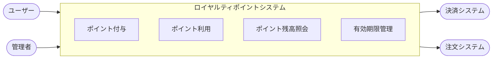
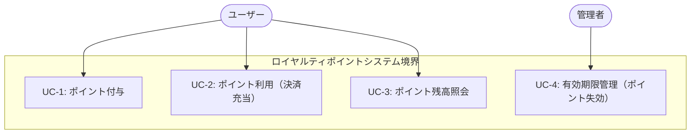
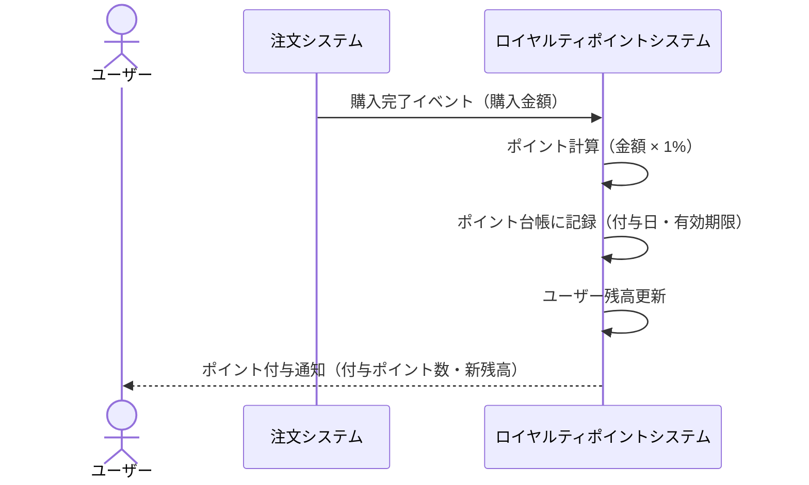
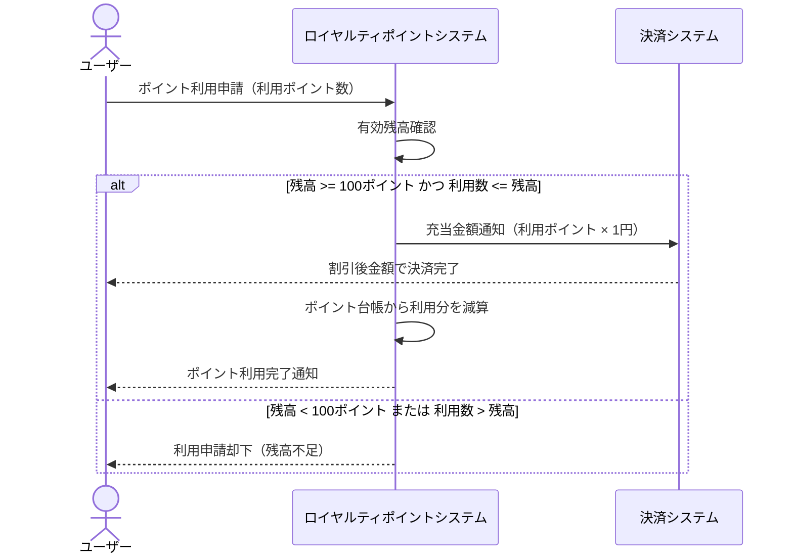
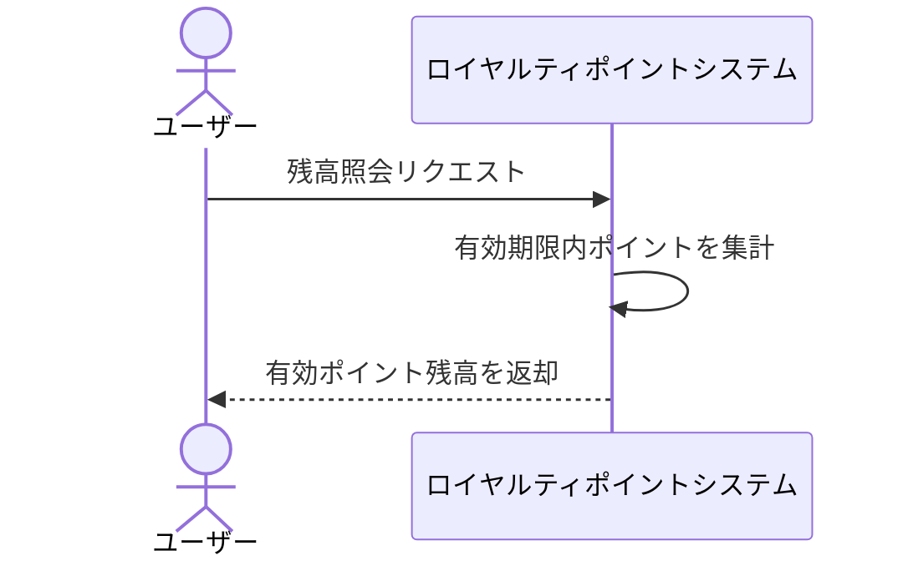
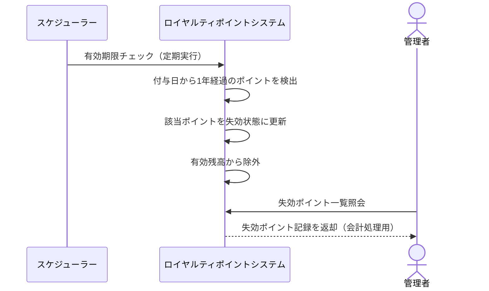
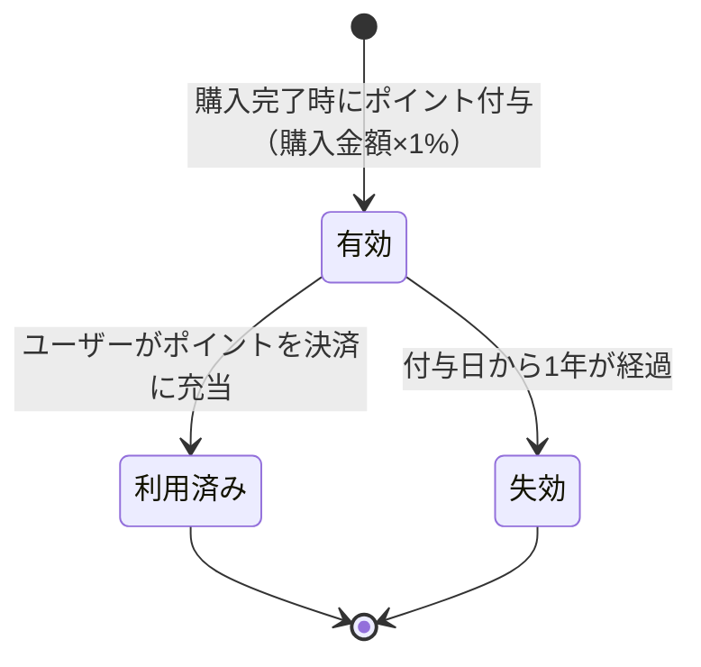

# 要件定義書

> **フォーマット:** RDRA3.0 | **要件記法:** EARS (Easy Approach to Requirements Syntax)
> 本書は ADR（アーキテクチャ決定記録）から自動生成されています。
> 原典: /docs/adr/ | 生成日: 2026-03-22

---

## 目次

1. システムコンテキスト
2. ビジネスコンテキスト
3. ユースケース
4. 情報モデル
5. 状態モデル
6. 要件一覧（EARS）
7. 変更履歴

---

## 1. システムコンテキスト

ロイヤルティポイントシステムは、ユーザーの購買継続率を高めるために導入するポイントプログラムです。ユーザーが商品を購入するたびに購入金額に応じたポイントを付与し、貯まったポイントを次回以降の購入時に利用できる仕組みを提供します。

### 1.1 システムコンテキスト図

### 1.2 アクター一覧

| アクター | 種別 | 説明 |
|---------|------|------|
| ユーザー | 人間 | 商品を購入し、ポイントを獲得・利用する顧客 |
| 管理者 | 人間 | ポイントプログラムの運用管理者。ポイント原資のコスト管理・有効期限切れポイントの会計処理を行う |
| 決済システム | 外部システム | 購入時の支払い処理およびポイント充当を行う外部システム |
| 注文システム | 外部システム | 購入完了イベントを発行し、ポイント付与のトリガーとなる外部システム |

---

## 2. ビジネスコンテキスト

### 2.1 背景と目的

購入促進施策として、ポイントプログラムを導入する。ユーザーの購買継続率を高めるため、購入ごとにポイントを還元し、次回購入時に利用できる仕組みを構築する。シンプルなルール設計によって実装コストを低く抑えながら、ユーザーの継続的な購買行動を促進することがビジネスゴールである。

### 2.2 ビジネスルール

| BR-ID | ルール | 根拠 ADR |
|-------|--------|---------|
| BR-001 | 購入金額の1%をポイントとして付与する（例：1,000円の購入 → 10ポイント付与） | ADR-0001 |
| BR-002 | ポイントは100ポイント以上から利用可能とする | ADR-0001 |
| BR-003 | 1ポイント = 1円として決済時に充当できる | ADR-0001 |
| BR-004 | ポイントの有効期限は付与日から1年間とする | ADR-0001 |
| BR-005 | 有効期限を過ぎたポイントは利用不可とし、残高から除外する | ADR-0001 |

### 2.3 利用シーン（Usage Scenarios）

**シーン1：通常購入時のポイント付与**
ユーザーが商品を購入し、決済が完了する。システムは購入金額の1%を自動的にポイントとして付与し、ポイント台帳に記録する。ユーザーはマイページ等で付与されたポイントと残高を確認できる。

**シーン2：ポイントを使った割引購入**
ユーザーが購入時にポイント利用を選択する。残高が100ポイント以上の場合、利用したいポイント数を指定し、1ポイント=1円として購入金額から差し引かれる。決済時にポイントが充当される。

**シーン3：ポイント有効期限の到来**
付与から1年が経過したポイントは自動的に失効する。システムは有効期限切れポイントを残高から除外し、利用できないように管理する。管理者は会計処理のために失効ポイントの記録にアクセスできる。

---

## 3. ユースケース

### 3.1 ユースケース図

### 3.2 システムユースケース詳細

#### UC-1: ポイント付与

| 項目 | 内容 |
|------|------|
| **アクター** | 注文システム（購入完了イベント発行）、ユーザー（受益者） |
| **事前条件** | ユーザーの購入が正常に完了（決済済み）であること |
| **基本フロー** | 1. 注文システムが購入完了イベントを発行する。2. ロイヤルティシステムが購入金額を受け取る。3. 購入金額の1%を計算し、ポイント数を算出する。4. 算出したポイントを付与日・有効期限（付与日から1年後）とともにポイント台帳に記録する。5. ユーザーのポイント残高を更新する。 |
| **代替フロー・例外** | 購入が返金・キャンセルされた場合、付与済みポイントを取り消す（推論に基づく・要確認） |
| **事後条件** | ユーザーのポイント残高が増加し、ポイント台帳に記録が残る |
| **受入コマンド** | `npm run test:e2e` |

**フロー図:**

#### UC-2: ポイント利用（決済充当）

| 項目 | 内容 |
|------|------|
| **アクター** | ユーザー |
| **事前条件** | ユーザーのポイント残高が100ポイント以上であること |
| **基本フロー** | 1. ユーザーが購入時にポイント利用を選択する。2. システムが有効なポイント残高を確認する。3. ユーザーが利用ポイント数を指定する。4. システムが1ポイント=1円として購入金額に充当する。5. 決済システムへポイント充当後の金額を渡す。6. ポイント台帳から利用ポイントを減算する。 |
| **代替フロー・例外** | ポイント残高が100ポイント未満の場合、利用申請を却下する。利用指定ポイントが残高を超える場合、利用申請を却下する。 |
| **事後条件** | ユーザーのポイント残高が減少し、購入金額がポイント分だけ割り引かれる |
| **受入コマンド** | `npm run test:e2e` |

**フロー図:**

#### UC-3: ポイント残高照会

| 項目 | 内容 |
|------|------|
| **アクター** | ユーザー |
| **事前条件** | ユーザーが認証済みであること |
| **基本フロー** | 1. ユーザーがポイント残高照会を要求する。2. システムが有効期限内のポイントのみを集計する。3. 現在の有効ポイント残高を返す。 |
| **代替フロー・例外** | 有効期限切れのポイントは残高に含めない |
| **事後条件** | ユーザーが現在利用可能なポイント残高を確認できる |
| **受入コマンド** | `npm run test:e2e` |

**フロー図:**

#### UC-4: 有効期限管理（ポイント失効）

| 項目 | 内容 |
|------|------|
| **アクター** | システム（自動）、管理者 |
| **事前条件** | ポイントの付与日から1年が経過していること |
| **基本フロー** | 1. システムが定期的に有効期限切れポイントを検出する。2. 期限切れポイントを失効状態に更新する。3. 有効残高から除外する。4. 管理者が失効ポイントの記録を会計処理に利用できる。 |
| **代替フロー・例外** | 失効処理中にエラーが発生した場合は失効を延期し、再試行する（推論に基づく・要確認） |
| **事後条件** | 有効期限切れポイントがユーザーの有効残高に含まれない。管理者が失効ポイントを確認できる。 |
| **受入コマンド** | `npm run test:e2e` |

**フロー図:**

---

## 4. 情報モデル

Decision に登場する名詞・エンティティを抽出して関係を示す。詳細な ER 図は doc:domain を参照。

### 4.1 主要情報（エンティティ）一覧

| 情報名 | 説明 | 主な属性 | 関連 ADR |
|--------|------|---------|---------|
| ポイント台帳エントリ | ポイントの付与・利用・失効を記録するトランザクション記録 | ポイント数、種別（付与/利用/失効）、付与日、有効期限（付与日+1年）、関連注文ID | ADR-0001 |
| ユーザーポイント残高 | ユーザーが現在利用可能な有効ポイントの合計 | ユーザーID、有効ポイント合計 | ADR-0001 |
| 購入情報 | ポイント付与の根拠となる購入トランザクション | 購入金額、購入日時、注文ID、ユーザーID | ADR-0001 |
| ポイント利用記録 | 決済時のポイント充当記録 | 利用ポイント数、充当金額（利用数×1円）、利用日時、注文ID | ADR-0001 |

---

## 5. 状態モデル

ADR-0001 の Decision には「有効期限内」と「有効期限切れ」の状態表現が含まれるため、ポイントエントリの状態モデルを以下に示す。

**状態の説明:**

| 状態 | 説明 |
|------|------|
| 有効 | 付与日から1年以内で、まだ利用されていないポイント。残高に含まれる。 |
| 利用済み | ユーザーが決済時に充当したポイント。残高から除外される。 |
| 失効 | 付与日から1年を経過したポイント。残高から除外される。管理者の会計処理対象。 |

---

## 6. 要件一覧（EARS 記法）

各要件は EARS 記法で記述する。パターンは Ubiquitous / Event / State / Unwanted / Optional から選ぶ。

| REQ-ID | EARS パターン | 要件文 | 種別 | 優先度 | 関連 UC | 根拠 ADR | 検証 |
|--------|-------------|--------|------|--------|--------|---------|------|
| REQ-001 | Event | WHEN a purchase is confirmed, the loyalty system shall award points equal to 1% of the purchase amount. | 機能 | Must | UC-1 | ADR-0001 | `npm run test:e2e` |
| REQ-002 | Ubiquitous | The loyalty system shall record a ledger entry for each point transaction, including the award date and expiry date (1 year from award date). | 機能 | Must | UC-1, UC-2, UC-4 | ADR-0001 | `npm run test:e2e` |
| REQ-003 | Unwanted | IF the available point balance is below 100 points, THEN the loyalty system shall reject the redemption request. | 機能 | Must | UC-2 | ADR-0001 | `npm run test:e2e` |
| REQ-004 | Event | WHEN a user redeems points at checkout, the loyalty system shall apply 1 point as 1 yen discount to the purchase amount. | 機能 | Must | UC-2 | ADR-0001 | `npm run test:e2e` |
| REQ-005 | State | WHILE points are within their 1-year validity period, the loyalty system shall include them in the user's available balance. | 機能 | Must | UC-3, UC-4 | ADR-0001 | `npm run test:e2e` |
| REQ-006 | Event | WHEN a point entry's expiry date is reached, the loyalty system shall mark the points as expired and exclude them from the available balance. | 機能 | Must | UC-4 | ADR-0001 | `npm run test:e2e` |
| REQ-007 | Ubiquitous | The loyalty system shall provide administrators with access to expired point records for accounting purposes. | 機能 | Must | UC-4 | ADR-0001 | `npm run test:e2e` |
| REQ-008 | Unwanted | IF the requested redemption amount exceeds the available balance, THEN the loyalty system shall reject the redemption request. | 機能 | Must | UC-2 | ADR-0001 | `npm run test:e2e` |
| REQ-009 | Ubiquitous | The loyalty system shall maintain an audit trail of all point transactions (award, redemption, expiry) for cost management. | 非機能 | Must | UC-1, UC-2, UC-4 | ADR-0001 | `npm run test:e2e` |
| REQ-010 | Ubiquitous | The loyalty system shall support accounting reconciliation of expired points at period-end. | 非機能 | Should | UC-4 | ADR-0001 | `npm run test:e2e` |

**優先度の定義（MoSCoW）:**
- **Must**: システムが成立するために必須
- **Should**: 強く推奨されるが、初期リリース時は省略可能
- **Could**: あれば望ましい
- **Won't**: 今回のスコープ外（将来の候補）

**非機能要件:**

ADR-0001 の Consequences > Drawbacks から抽出した非機能要件：

| 区分 | 内容 | 根拠 |
|------|------|------|
| コスト管理 | ポイント原資のコスト管理基盤が必要（ポイント付与総額の追跡）。REQ-009 でカバー。 | ADR-0001 Drawbacks |
| 会計処理 | 有効期限切れポイントの会計処理フローが必要。REQ-010 でカバー。 | ADR-0001 Drawbacks |

---

## 7. 変更履歴

変更履歴なし（Superseded 状態の ADR は現時点で存在しない）

| ADR | 変更内容 | 置換先 | 日付 |
|-----|---------|--------|------|
| — | — | — | — |
