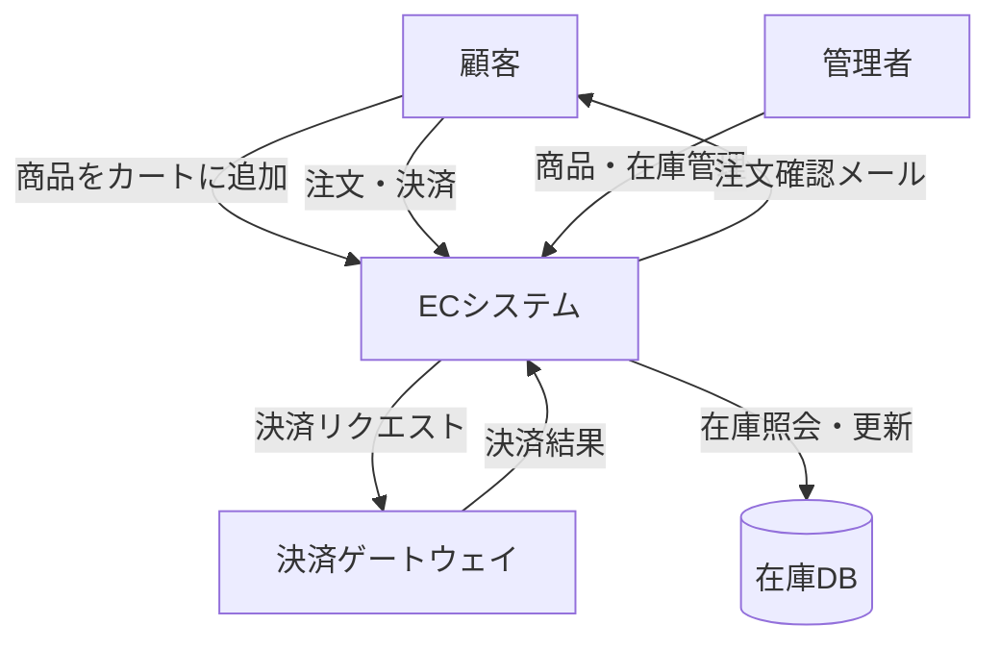
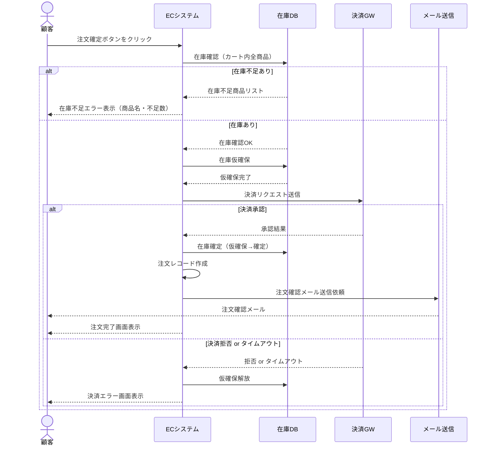
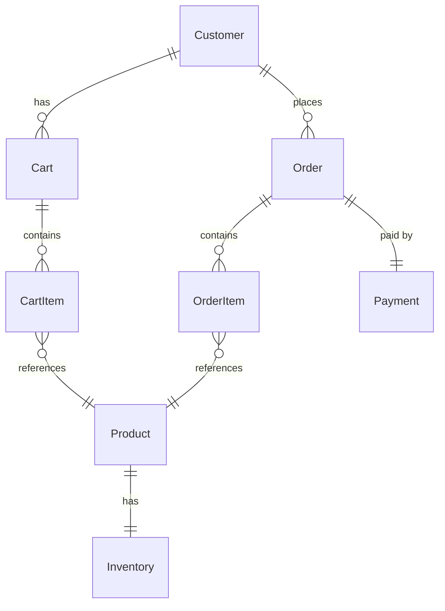
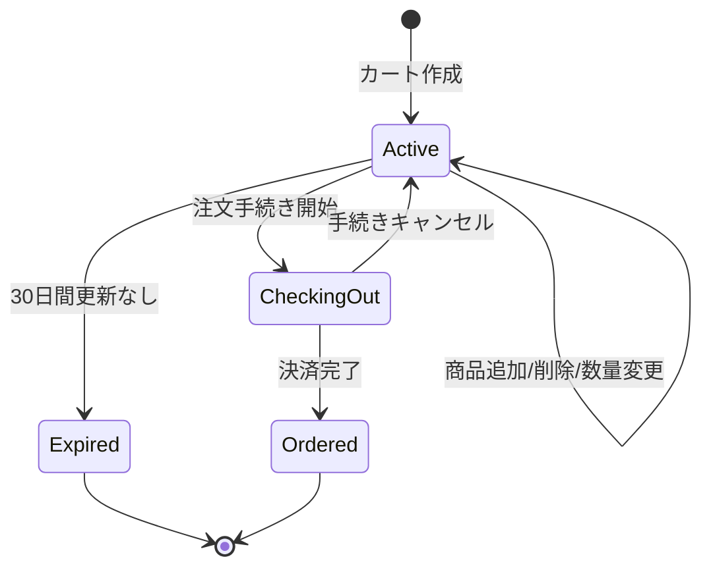
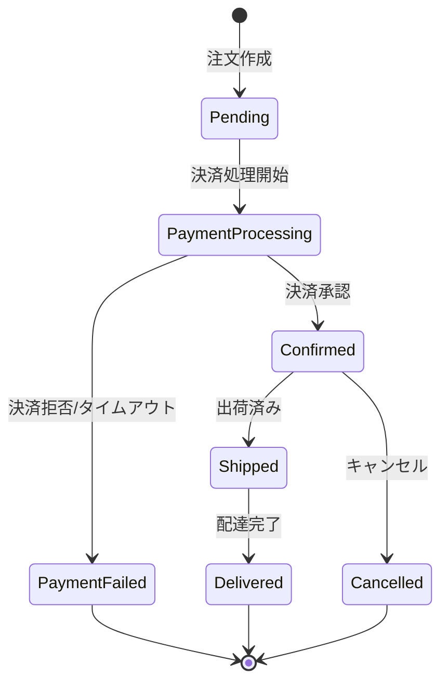
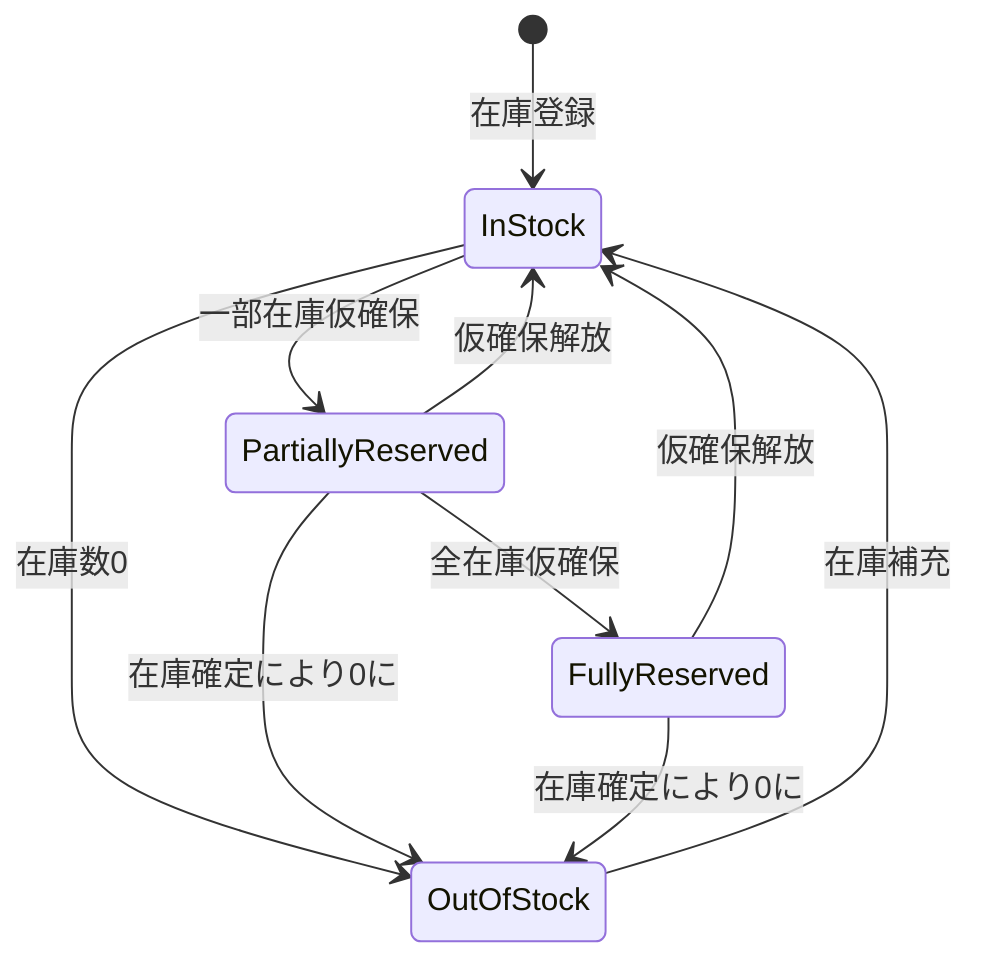

# 要件定義書：カート・決済フロー

**バージョン:** 1.0.0
**作成日:** 2026-03-22
**ステータス:** Draft

---

## 1. システムコンテキスト

**システム境界:** ECシステム（カート管理・注文処理・決済連携・在庫管理）

**主要アクター:**
| アクター | 説明 |
|---|---|
| 顧客 | 商品を購入するエンドユーザー |
| 管理者 | 商品・在庫・注文を管理する担当者 |
| 決済ゲートウェイ | 外部決済サービス（クレジットカード等） |

---

## 2. ビジネスコンテキスト

### ビジネスルール

| BR-ID | ルール名 | 説明 |
|---|---|---|
| BR-001 | カート有効期限 | カートは最終更新から30日間有効とする |
| BR-002 | 在庫確保タイミング | 決済処理開始時に在庫を仮確保し、決済完了後に確定する |
| BR-003 | 在庫不足時の処理 | 決済開始時点で在庫が0の場合、注文を受け付けない |
| BR-004 | 複数在庫不足 | カート内に在庫不足商品が複数ある場合、すべてをユーザーに通知する |
| BR-005 | 決済タイムアウト | 決済ゲートウェイへのリクエストは30秒でタイムアウトとする |
| BR-006 | 仮確保の解放 | 決済失敗・タイムアウト時は仮確保した在庫を即時解放する |
| BR-007 | 注文確認通知 | 決済完了後、登録メールアドレスへ注文確認メールを送信する |
| BR-008 | 最小注文数量 | 1商品あたりの注文数量は1以上とする |
| BR-009 | 最大注文数量 | 1商品あたりの注文数量は在庫数を超えてはならない |
| BR-010 | カート上限 | 1カートに登録できる商品種別は最大50種とする |

---

## 3. ユースケース

### ユースケース一覧

| UC-ID | ユースケース名 | アクター | 関連BR |
|---|---|---|---|
| UC-001 | 商品をカートに追加する | 顧客 | BR-001, BR-008, BR-010 |
| UC-002 | カートを確認・編集する | 顧客 | BR-001, BR-009 |
| UC-003 | 注文情報を入力する | 顧客 | - |
| UC-004 | 決済を実行する | 顧客, 決済ゲートウェイ | BR-002, BR-003, BR-004, BR-005, BR-006 |
| UC-005 | 注文完了を確認する | 顧客 | BR-007 |
| UC-006 | 在庫不足エラーを処理する | 顧客 | BR-003, BR-004, BR-006 |

### UC-001: 商品をカートに追加する

| 項目 | 内容 |
|---|---|
| アクター | 顧客 |
| 事前条件 | 顧客が商品詳細ページを閲覧している |
| 成功事後条件 | 商品がカートに追加され、カート内商品数が更新される |
| 失敗事後条件 | エラーメッセージが表示され、カートは変更されない |

**基本フロー:**
1. 顧客が商品の数量を指定する
2. 顧客が「カートに追加」ボタンをクリックする
3. システムが在庫数を確認する
4. システムがカートに商品を追加する
5. システムがカートアイコンの数量を更新する
6. システムが追加完了メッセージを表示する

**代替フロー (3a):** 在庫不足
- 3a-1. システムが在庫不足メッセージを表示する
- 3a-2. 顧客が数量を変更するか操作を中止する

### UC-004: 決済を実行する

| 項目 | 内容 |
|---|---|
| アクター | 顧客, 決済ゲートウェイ |
| 事前条件 | カートに1件以上の商品があり、注文情報が入力済みである |
| 成功事後条件 | 注文が作成され、在庫が減少し、確認メールが送信される |
| 失敗事後条件 | 注文は作成されず、仮確保した在庫は解放される |

**基本フロー:**
1. 顧客が「注文を確定する」ボタンをクリックする
2. システムがカート内全商品の在庫を再確認する
3. システムが在庫を仮確保する
4. システムが決済ゲートウェイへ決済リクエストを送信する
5. 決済ゲートウェイが決済を処理し承認結果を返す
6. システムが仮確保を確定し在庫を減算する
7. システムが注文レコードを作成する
8. システムが注文確認メールを送信する
9. システムが注文完了画面を表示する

**代替フロー (2a):** 在庫不足
- 2a-1. システムが在庫不足の商品を特定する
- 2a-2. システムが在庫不足エラー画面を表示する（BR-004）
- 2a-3. 顧客がカートを修正する

**代替フロー (5a):** 決済拒否
- 5a-1. 決済ゲートウェイが拒否結果を返す
- 5a-2. システムが仮確保を解放する（BR-006）
- 5a-3. システムが決済エラーメッセージを表示する

**代替フロー (4a):** 決済タイムアウト
- 4a-1. 30秒経過しても応答がない（BR-005）
- 4a-2. システムが仮確保を解放する（BR-006）
- 4a-3. システムがタイムアウトエラーを表示する

### シーケンス図：決済フロー

---

## 4. 情報モデル

### エンティティ一覧

| エンティティ | 属性 | 説明 |
|---|---|---|
| 顧客 (Customer) | customer_id, email, name, address | ECサイトの登録ユーザー |
| 商品 (Product) | product_id, name, price, description, image_url | 販売対象の商品 |
| 在庫 (Inventory) | inventory_id, product_id, quantity, reserved_quantity | 商品ごとの在庫数と仮確保数 |
| カート (Cart) | cart_id, customer_id, created_at, updated_at, expires_at | 顧客のショッピングカート |
| カートアイテム (CartItem) | cart_item_id, cart_id, product_id, quantity | カート内の個別商品と数量 |
| 注文 (Order) | order_id, customer_id, total_amount, status, created_at | 確定した注文 |
| 注文明細 (OrderItem) | order_item_id, order_id, product_id, quantity, unit_price | 注文内の個別商品 |
| 決済 (Payment) | payment_id, order_id, method, status, gateway_ref, processed_at | 決済情報と処理結果 |

### エンティティ関連

---

## 5. 状態モデル

### カート状態遷移

### 注文状態遷移

### 在庫状態遷移

---

## 6. 要件一覧（EARS）

### 機能要件

| REQ-ID | カテゴリ | EARSパターン | 要件文 | 関連UC | 関連BR |
|---|---|---|---|---|---|
| REQ-001 | カート | Ubiquitous | The システム shall カートを顧客ごとに一意に管理する | UC-001 | BR-001 |
| REQ-002 | カート | Event-driven | WHEN 顧客が商品をカートに追加する the システム shall 在庫数を確認してから追加処理を行う | UC-001 | BR-008 |
| REQ-003 | カート | State-driven | WHILE カートの最終更新から30日が経過している the システム shall カートを無効化する | UC-001 | BR-001 |
| REQ-004 | カート | Unwanted behavior | IF カートの商品種別数が50を超える THEN the システム shall 追加を拒否し上限超過メッセージを表示する | UC-001 | BR-010 |
| REQ-005 | カート | Unwanted behavior | IF 指定数量が在庫数を超える THEN the システム shall カートへの追加を拒否し在庫不足メッセージを表示する | UC-001 | BR-009 |
| REQ-006 | 決済 | Event-driven | WHEN 顧客が注文を確定する the システム shall カート内全商品の在庫を再確認する | UC-004 | BR-002 |
| REQ-007 | 決済 | Event-driven | WHEN 在庫確認が完了する the システム shall 対象商品の在庫を仮確保する | UC-004 | BR-002 |
| REQ-008 | 決済 | Event-driven | WHEN 決済が承認される the システム shall 仮確保在庫を確定し在庫数を減算する | UC-004 | BR-002 |
| REQ-009 | 決済 | Event-driven | WHEN 決済処理が完了する the システム shall 注文レコードと注文明細を作成する | UC-004, UC-005 | - |
| REQ-010 | 決済 | Event-driven | WHEN 注文が確定する the システム shall 顧客の登録メールアドレスへ注文確認メールを送信する | UC-005 | BR-007 |
| REQ-011 | 決済 | Unwanted behavior | IF 決済開始時に在庫不足商品が存在する THEN the システム shall 在庫不足商品の一覧を表示し注文処理を中断する | UC-006 | BR-003, BR-004 |
| REQ-012 | 決済 | Unwanted behavior | IF 決済ゲートウェイが拒否を返す THEN the システム shall 仮確保した在庫を即時解放し決済失敗メッセージを表示する | UC-004 | BR-006 |
| REQ-013 | 決済 | Unwanted behavior | IF 決済リクエストが30秒以内に応答しない THEN the システム shall タイムアウトとして処理し仮確保した在庫を解放する | UC-004 | BR-005, BR-006 |
| REQ-014 | 在庫 | Ubiquitous | The システム shall 在庫数と仮確保数を分けて管理する | UC-004 | BR-002 |
| REQ-015 | 在庫 | State-driven | WHILE 仮確保処理中 the システム shall 同一商品への並行する仮確保リクエストを排他制御する | UC-004 | BR-002 |
| REQ-016 | 在庫 | Unwanted behavior | IF カート内複数商品に在庫不足が発生する THEN the システム shall 不足している全商品の商品名と不足数をまとめて通知する | UC-006 | BR-004 |

### 非機能要件

| REQ-ID | カテゴリ | EARSパターン | 要件文 |
|---|---|---|---|
| REQ-N01 | 性能 | Ubiquitous | The システム shall 在庫確認処理を1秒以内に完了する |
| REQ-N02 | 性能 | Ubiquitous | The システム shall 決済完了画面を決済承認後3秒以内に表示する |
| REQ-N03 | 可用性 | Ubiquitous | The システム shall 決済処理中のシステム障害発生時に仮確保した在庫を自動解放する |
| REQ-N04 | セキュリティ | Ubiquitous | The システム shall 決済情報をPCI-DSS準拠の方法で取り扱う |
| REQ-N05 | 整合性 | Unwanted behavior | IF 在庫確定処理中にシステム障害が発生する THEN the システム shall トランザクションをロールバックし在庫の二重減算を防ぐ |

---

## 7. 変更履歴

| バージョン | 日付 | 変更者 | 変更内容 |
|---|---|---|---|
| 1.0.0 | 2026-03-22 | - | 初版作成：カートから決済完了までのフローと在庫不足エラーハンドリングの要件を定義 |
